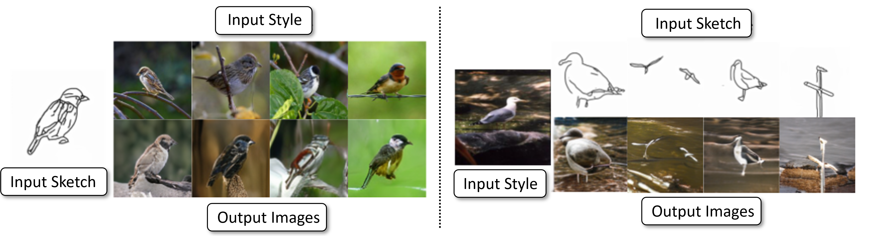

# CoGS: Controllable Generation and Search from Sketch and Style

[Cusuh Ham](https://cusuh.github.io/)\*,
[Gemma Canet Tarrés](https://www.surrey.ac.uk/people/gemma-canet-tarres)\*,
[Tu Bui](https://tubui.github.io/),
[James Hays](https://faculty.cc.gatech.edu/~hays),
[Zhe Lin](https://sites.google.com/site/zhelin625/),
[John Collomosse](http://personal.ee.surrey.ac.uk/Personal/J.Collomosse/research.php)<br/>
\* equal contribution


[arXiv](https://arxiv.org/abs/2203.09554) | [BibTeX](#bibtex) | [Project Page](https://cusuh.github.io/CoGS/)


## Requirements
Create and activate a [Conda](https://conda.io/) or [Miniconda](https://docs.conda.io/en/latest/miniconda.html) environment named `cogs` with all the necessary dependencies using the following command:

```
conda env create -f environment.yaml
conda activate cogs
```

## Pseudosketches Dataset

Download the [Pseudosketches dataset](). There are train/val input file lists under `data/pseudosketches`, where each line contain a tuple of corresponding inputs:
```
synset_id/sketch.JPEG,synset_id/style.JPEG,synset_id/image.JPEG
```
The sketch and image are corresponding pairs from the Pseudosketches dataset, while the style image is selected by using a pre-trained [ALADIN](https://openaccess.thecvf.com/content/ICCV2021/papers/Ruta_ALADIN_All_Layer_Adaptive_Instance_Normalization_for_Fine-Grained_Style_Similarity_ICCV_2021_paper.pdf) to compute the most stylistically similar image to the original image.


## Training models

### Pseudosketches VQGAN

Train a VQGAN on Pseudosketches with:
```
python main.py --base configs/pseudosketches_vqgan.yaml -t True --gpus 0,
```

Then, adjust the checkpoint path under `model.params.sketch_encoder_config.params.ckpt_path` in `configs/pseudosketches_cogs_transformer.yaml`. Alternatively, you can download our [pre-trained Pseudosketches VQGAN checkpoint]() and place it into `checkpoints/`, which corresponds to the default checkpoint path in the config file).

### ImageNet VQGAN

For training a VQGAN on ImageNet, refer to the [taming-transformers](https://github.com/CompVis/taming-transformers) repository. Alternatively, use their [pre-trained ImageNet VQGAN checkpoint](https://k00.fr/u0j2dtac) and place under `checkpoints/` (the default checkpoint path in the config has the filed renamed as `imagenet_vqgan_last.ckpt`). If you trained your own, adjust the checkpoint path under `model.params.image_encoder_config.params.ckpt_path` in
`configs/pseudosketches_cogs_transformer.yaml`.

We use the same ImageNet VQGAN to encode both the style and ground truth images.

### CoGS Transformer

To train the transformer stage of CoGS, run:
```
python main.py --base configs/pseudosketches_cogs_transformer.yaml -t True --gpus 0,
```

We also provide a [pre-trained CoGS transformer checkpoint]().

### CoGS VAE

TODO


## Sampling

After training a transformer described above or downloading a pre-trained model, you can sample images by running:
```
python scripts/sample_cogs_transformer.py --resume logs/<experiment_name> --out_dir <path/to/output/directory>
```


## Acknowledgements
Our code is developed from the [taming-transformers](https://github.com/CompVis/taming-transformers) repository.

## BibTeX

```
@article{ham2022cogs,
  title={CoGS: Controllable Generation and Search from Sketch and Style},
  author={Ham, Cusuh and Tarres, Gemma Canet and Bui, Tu and Hays, James and Lin, Zhe and Collomosse, John},
  journal={European Conference on Computer Vision},
  year={2022}
}
```
